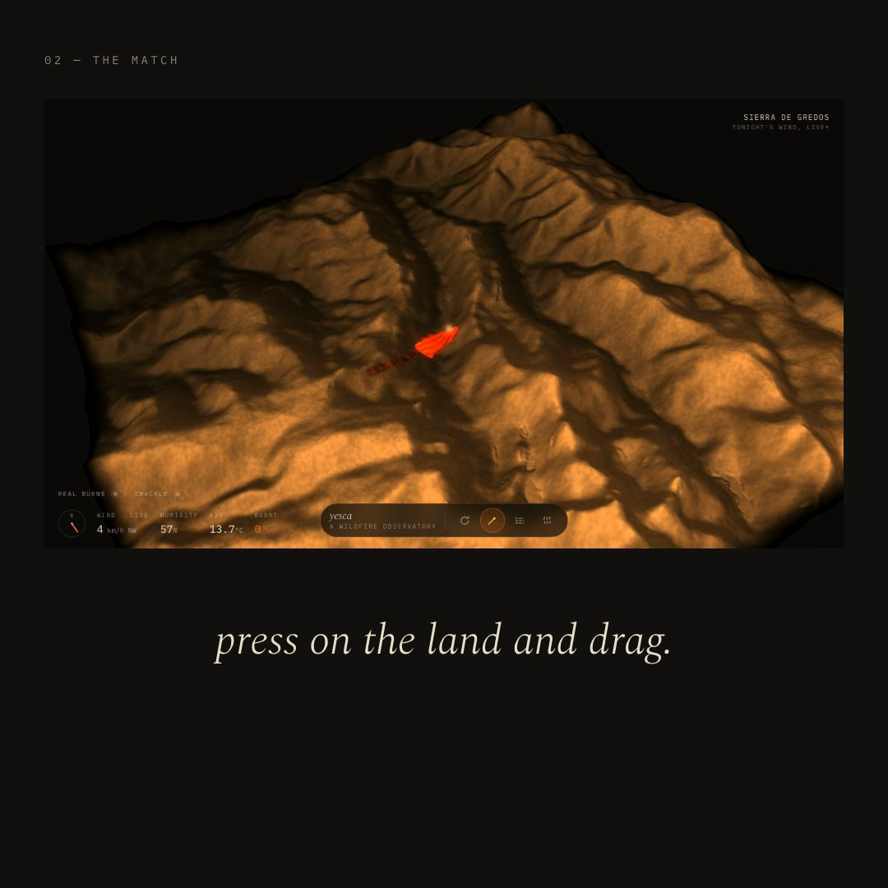

# yesca



**Strike a match anywhere on Earth. Real terrain and tonight's real wind do the rest.**

Live: **https://yesca-theta.vercel.app**

## What it does

yesca is a wildfire observatory rendered like a tabletop instrument. Pick a hillside — the Sierra de Gredos, Vesuvius, or anywhere you can name — and its real elevation rises out of the dark like a relief model being milled. Tonight's weather is already loaded. Press on the land, drag, and you've struck a match: the scratch chars a groove, the head flares, and a fire starts moving wherever the wind actually blows right now.

Fire crawls uphill faster than it runs down. A firebreak — a carved line the front cannot cross — stops it dead. Rain falls as you drag and damps the fuel. The instruments tick as the burn grows: wind vane, live humidity, air temperature, square kilometres scarred. Toggle "real burns" and NASA's VIIRS satellites answer out loud with every thermal detection they logged near your hillside over the last four days.

Everything is honest. A match on bare rock sparks and dies. Thin fuel smoulders. The numbers on the dials are the ones the fire is actually obeying.

## How it works

The fire is a cellular automaton running entirely on the GPU. A 768×768 state texture encodes fuel, heat, ignition time and scratch in RGBA channels; each frame, a fragment shader samples the eight neighbours, weighs them by slope (uphill cells catch faster, downwind cells throw farther), humidity and per-cell jitter, then writes the next state back. Ping-pong render targets mean a million cells update at display rate without ever touching the CPU — the sim is a pure feedback loop, which is why the front develops the ragged, self-organising edges of a real burn instead of spreading like a fill.

Terrain is real Mapzen Terrarium elevation decoded into a displacement-mapped mesh. Weather is the current Open-Meteo forecast at that coordinate. The "real burns" overlay decodes NASA GIBS vector tiles (FIRMS VIIRS 375 m detections) into exact locations — no imagery, no mock data.

## Run locally

```bash
npm install
npm run dev      # vite dev server
npm run build    # production build
npm run preview  # serve the build
```

No keys required — terrain, weather and satellite data are all keyless public APIs.

## Stack

- React + TypeScript + Vite
- three.js, WebGL2, hand-written GLSL3 shaders
- GPU render-target cellular automaton (ping-pong, float textures with feature probe)
- Mapzen Terrarium elevation · Open-Meteo weather · NASA GIBS/FIRMS vector tiles
- @mapbox/vector-tile + pbf · @number-flow/react · torph · web-haptics
- Web Audio crackle bed (procedural, no samples)

## License

MIT. Do anything — credit is a nice touch.
